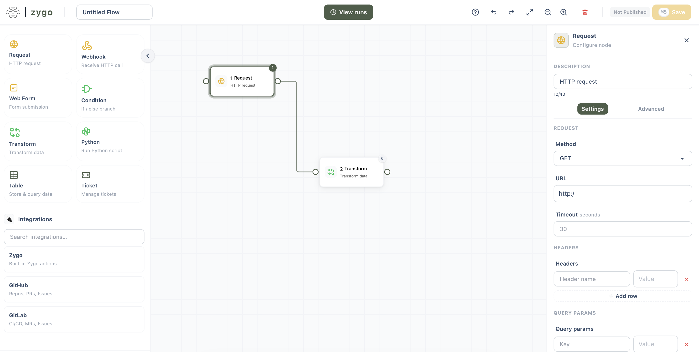
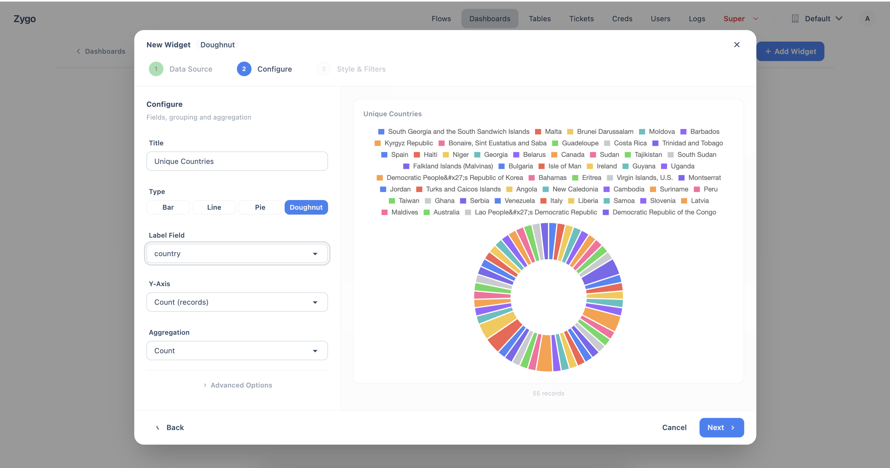

#  Zygo

Zygo is a multi-tenant workflow automation platform for InfoSec (Security) and IT teams.







## What You Can Do

- **Build flows visually** — drag and drop nodes on a canvas to create automations without writing code
- **Connect to anything** — make HTTP requests to any API, receive webhooks, and process data in real time
- **Collect input** — publish web forms that trigger flows when submitted, with multi-step wizard support
- **Store and query data** — built-in data tables let your flows persist records across runs
- **Track work** — create tickets from flows for human review, approvals, and task tracking
- **Visualize results** — build dashboards with charts and stat cards from the data your flows collect

## Quick Start

1. Clone the repository
```commandline
git clone https://github.com/bmarsh9/zygo.git && cd zygo
```

2. Create `.env` file in the repo. This is used by the docker compose.
```commandline
#.env file
ENABLE_SELF_REGISTRATION=<true or false>
MAIL_USERNAME=<insert SMTP email>
MAIL_PASSWORD=<insert SMTP password for email>
HOST_NAME=<insert fqdn with scheme such as https://your-app.com>
HELP_EMAIL=<insert help email>
INTERNAL_API_SECRET=<insert random, 20+ string>
FERNET_KEY=<generate key using: python -c "from cryptography.fernet import Fernet; print(Fernet.generate_key().decode())">
```

3. Start the app with Docker compose
```commandline
docker compose up -d --build
```

4. Visit http://localhost:8000

5. Use `admin@example.com` and `admin1234567` to login as super user

6. [Create your first flow!](https://darkbanner.mintlify.app/quickstart)
